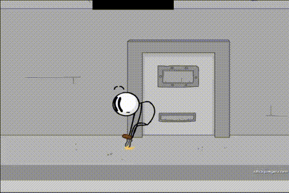

## 甚麼是 Yoylecake？

Yoylecake 是一種源自網絡動畫系列 [Battle for Dream Island](http://bfdi.tv/)、不存在於現實的蛋糕，它是由來自 Yoyleland 的 Yoyleberry 樹果製作。



## Yoylecake 的影片

<figure>

<figcaption>

The original animation was made by Jacknjellify. To view the whole episode, please visit the YouTube playlist [HERE](http://bfdi.tv/). (Also, `noclip` is required.)

</figcaption>
</figure>

## Yoylecake 的截圖





